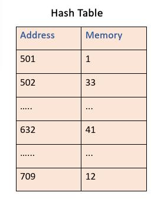
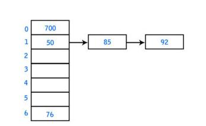

# Hash Tables

## Introduction

- A Hash Table is a data structure which stores values in a `key, value` format.

- It is designed to have high lookup speed using the `key` to retrieve it's corresponding value.

- The `key` must be unique.

- Unlike Arrays, In Hash Tables, address space used in the memory is not contiguous.

- This means a value stored in the table can be in any address space within the memory allocated to the table.

- Example:  

## Types

- Hash tables have different variations
    1. Hash Maps
    2. Maps
    3. Unordered maps
    4. Objects
    5. Dictionary
    6. Sets -> Hash tables with only the keys

-  There are minor differences in different implementations however the core working logic remains the same.

- Many languges have their own implementation of hash tables which we can use.

    1. Python
        1. Dictionary: `dict()`
        2. Set: `set()`
    2. Javascript
        1. Object: `Object()` or `{}`
    3. Java
        1. `Hashtable`
        2. `HashMap`

## Hash Function

- The Hash function is the most important component of the Hash table.

- The Hash function is used to calculate the index, also hash code which is used to determine where the value is stored in memory.

- During lookup, the key is hashed and the resulting hash indicates where the corresponding value is stored.

- Some popular hashing algorithms are:
    1. md5
    2. sha1
    3. sha256

- Hash functions must be **idempotent**. Meaning the result of hashing for a key must always be consistent.

- A quick hashing function is more suitable for Hash Tables as we need fast lookup time. For example, sha256 is a slower hashing function used in authentication and encryption protocols which is not suitable for this purpose.

## Big O Table

| Operation | Big O |
|-----------|-------|
| Insert    | O(1)  |
| Delete    | O(1)  |
| Lookup    | O(1)  |
| Search    | O(1)  |

## Hash Collision

- When 2 different key values generate the same hash value it is called hash collision.

- During hash collision, multiple objects are assigned to same memory space.

- Hash collision can be resolved in multiple ways.
    1. **Chaining:** This technique implements a linked list and is the most popular collision resolution techniques. 
          
    2. **[Open Addressing ](https://www.geeksforgeeks.org/hashing-set-3-open-addressing/)**
    3. **Probabilistic hashing:** When collision occurs, either the old record is replaced by the new or the new record may be dropped. Although this scenario has a risk of losing data, it is still preferred due to its ease of implementation and high performance.
    4. **Perfect hashing:** When the slots are uniquely mapped, there is very less chances of collision. However, it can be done where there is a lot of spare memory.
    5. **[Coalesced hashing](https://www.geeksforgeeks.org/coalesced-hashing/)**

## Extras

- In programming languages you can also store functions as hash table values

- In a Hash Map insertion order is maintained. Whereas in a Hash Table it generally is not.

- Since Python 3.7 , Dicts are ordered by default . More on this in this [article](https://softwaremaniacs.org/blog/2020/02/05/dicts-ordered/en/)

- Sets similar to map but only save keys

## Review

In an interview context, Hash Tables are **sually used to optimize time complexity of a solution**

### Hash Table vs Arrays

| Operation | Array | Hash Table |
|-----------|-------|------------|
| Insert    | O(n)  | O(1)       |
| Delete    | O(n)  | O(1)       |
| Push      | O(1)  | -          |
| Lookup    | O(1)  | O(1)       |
| Search    | O(n)  | O(1)       |